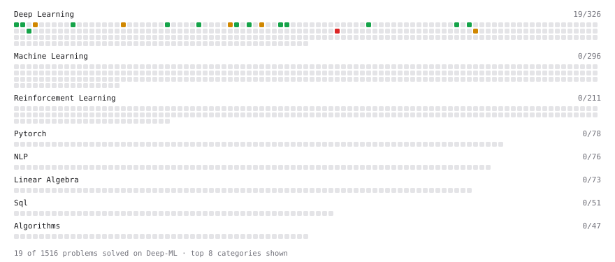

# Deep-ML

My machine learning practice from [Deep-ML](https://www.deep-ml.com). Every solution here was written by hand.

**20** solved · 20 problems · 0 labs · 0 math

[**Browse the interactive portfolio**](https://rabeyasiddiquiluna.github.io/deep-ml/) to replay this filling in over time.

## Problems

| | Difficulty | Solved | |
| --- | --- | --- | --- |
| [Adamax Optimizer](https://www.deep-ml.com/problems/148) | easy | 2026-08-12 | [solution](problems/0148-adamax-optimizer) |
| [Compute Multi-class Cross-Entropy Loss](https://www.deep-ml.com/problems/134) | easy | 2026-08-10 | [solution](problems/0134-compute-multi-class-cross-entropy-loss) |
| [Derivatives of Activation Functions](https://www.deep-ml.com/problems/217) | easy | 2026-08-10 | [solution](problems/0217-derivatives-of-activation-functions) |
| [Dynamic Tanh: Normalization-Free Transformer Activation](https://www.deep-ml.com/problems/128) | easy | 2026-08-10 | [solution](problems/0128-dynamic-tanh-normalization-free-transformer-activation) |
| [GeLU Activation Function ](https://www.deep-ml.com/problems/147) | easy | 2026-08-10 | [solution](problems/0147-gelu-activation-function) |
| [Implement 2D Average Pooling](https://www.deep-ml.com/problems/265) | easy | 2026-08-10 | [solution](problems/0265-implement-2d-average-pooling) |
| [Implement Binary Cross-Entropy Loss](https://www.deep-ml.com/problems/263) | easy | 2026-08-12 | [solution](problems/0263-implement-binary-cross-entropy-loss) |
| [Implement Global Average Pooling](https://www.deep-ml.com/problems/114) | easy | 2026-08-10 | [solution](problems/0114-implement-global-average-pooling) |
| [Implement RMSNorm (Root Mean Square Layer Normalization)](https://www.deep-ml.com/problems/372) | easy | 2026-08-10 | [solution](problems/0372-implement-rmsnorm-root-mean-square-layer-normalization) |
| [Implement the Softsign Activation Function](https://www.deep-ml.com/problems/100) | easy | 2026-08-10 | [solution](problems/0100-implement-the-softsign-activation-function) |
| [Leaky ReLU Activation Function](https://www.deep-ml.com/problems/44) | easy | 2026-08-10 | [solution](problems/0044-leaky-relu-activation-function) |
| [Regularization via Information Bottleneck](https://www.deep-ml.com/problems/503) | easy | 2026-08-13 | [solution](problems/0503-regularization-via-information-bottleneck) |
| [Sigmoid Activation Function Understanding](https://www.deep-ml.com/problems/22) | easy | 2026-08-10 | [solution](problems/0022-sigmoid-activation-function-understanding) |
| [Softmax Activation Function Implementation ](https://www.deep-ml.com/problems/23) | easy | 2026-08-11 | [solution](problems/0023-softmax-activation-function-implementation) |
| [Adam Optimizer](https://www.deep-ml.com/problems/87) | medium | 2026-08-10 | [solution](problems/0087-adam-optimizer) |
| [Adaptive Layer Normalization for Conditional Generation](https://www.deep-ml.com/problems/684) | medium | 2026-08-12 | [solution](problems/0684-adaptive-layer-normalization-for-conditional-generation) |
| [Implement Group Normalization](https://www.deep-ml.com/problems/126) | medium | 2026-08-12 | [solution](problems/0126-implement-group-normalization) |
| [Instance Normalization (IN) Implementation](https://www.deep-ml.com/problems/143) | medium | 2026-08-10 | [solution](problems/0143-instance-normalization-in-implementation) |
| [Single Neuron with Backpropagation](https://www.deep-ml.com/problems/25) | medium | 2026-08-11 | [solution](problems/0025-single-neuron-with-backpropagation) |
| [Build a Transformer Encoder Layer](https://www.deep-ml.com/problems/491) | hard | 2026-08-11 | [solution](problems/0491-build-a-transformer-encoder-layer) |

---

_This file is regenerated by Deep-ML on every push._
